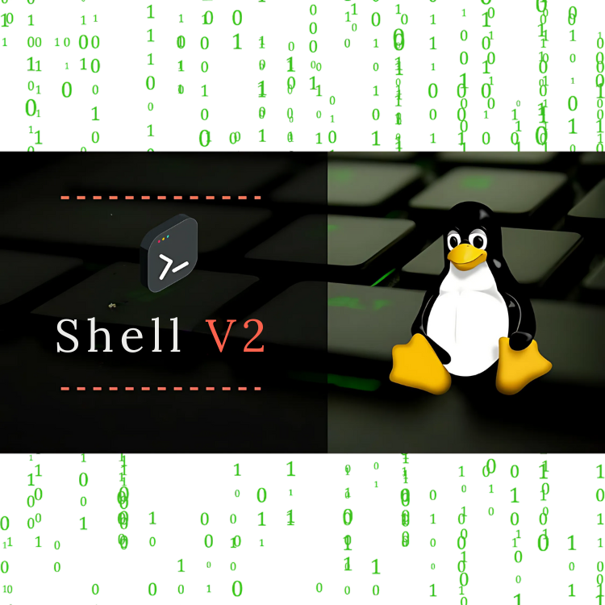

<div align="center">
<br>



</div>


<p align="center">


</p>


<h1 align="center"> C - Shell v2 </h1>


<h3 align="center">
<a href="https://github.com/RazikaBengana/holbertonschool-shell_v2#eye-about">About</a> •
<a href="https://github.com/RazikaBengana/holbertonschool-shell_v2#hammer_and_wrench-tasks">Tasks</a> •
<a href="https://github.com/RazikaBengana/holbertonschool-shell_v2#memo-learning-objectives">Learning Objectives</a> •
<a href="https://github.com/RazikaBengana/holbertonschool-shell_v2#computer-requirements">Requirements</a> •
<a href="https://github.com/RazikaBengana/holbertonschool-shell_v2#bulb-more-info">More Info</a> •
<a href="https://github.com/RazikaBengana/holbertonschool-shell_v2#package-installation">Installation</a> •
<a href="https://github.com/RazikaBengana/holbertonschool-shell_v2#keyboard-basic-usage">Basic usage</a> •
<a href="https://github.com/RazikaBengana/holbertonschool-shell_v2#mag_right-resources">Resources</a> •
<a href="https://github.com/RazikaBengana/holbertonschool-shell_v2#bust_in_silhouette-authors">Authors</a> •
<a href="https://github.com/RazikaBengana/holbertonschool-shell_v2#octocat-license">License</a>
</h3>

---

<!-- ------------------------------------------------------------------------------------------------- -->

<br>
<br>

## :eye: About

<br>

<div align="center">

**`C - Shell v2`** project is an advanced version of the `simple shell` program that enhances user interaction with additional features and improved command execution.
<br>
The programs include features such as advanced command parsing, signal handling, and environment variable management.
<br>
<br>
This project has been created by [**Holberton School**](https://www.holbertonschool.com/about-holberton) to enable every student to understand how **complex shell functionalities** in C language work.

</div>

<br>
<br>

<!-- ------------------------------------------------------------------------------------------------- -->

## :hammer_and_wrench: Tasks

<br>

**`0. README, man, AUTHORS`**

**`1. Betty would be proud`**

**`2. hsh 1.0`**

**`3. hsh 1.1`**

**`4. hsh 1.2`**

**`5. hsh 1.3`**

**`6. hsh 1.4`**

**`7. hsh 1.5`**

**`8. hsh 1.6`**

**`9. hsh 1.7`**

**`10. hsh 1.8`**

**`11. hsh 2.0`**

**`12. hsh 1.1.1`**

**`13. Ctrl + C`**

**`14. Aliases`**

**`15. $VARIABLES`**

**`16. #Comments`**

**`17. Help !`**

**`18. Move on`**

**`19. Try to run this!`**

**`20. . .hshrc`**

**`21. $PS1`**

<br>
<br>

<!-- ------------------------------------------------------------------------------------------------- -->

## :memo: Learning objectives

<br>

**_You are expected to be able to [explain to anyone](https://fs.blog/feynman-learning-technique/), without the help of Google:_**

<br>

```diff

General

+ Who designed and implemented the original Unix operating system

+ Who wrote the first version of the UNIX shell

+ Who invented the B programming language (the direct predecessor to the C programming language)

+ Who is Ken Thompson

+ How does a shell work

+ What are a pid and a ppid

+ How to manipulate the environment of the current process

+ What is the difference between a function and a system call

+ How to create processes

+ What are the three prototypes of main

+ How does the shell use the PATH to find the programs

+ How to execute another program with the execve system call

+ How to suspend the execution of a process until one of its children terminates

+ What is EOF / “end-of-file”?

+ How to redirect the content of a file into another file

+ What is a pipeline

+ How to setup a pipe

+ How to setup a pipe between two processes

```

<br>
<br>

<!-- ------------------------------------------------------------------------------------------------- -->

## :computer: Requirements

<br>

```diff

General

+ Allowed editors: vi, vim, emacs

+ All your files will be compiled on Ubuntu 20.04 LTS

+ Your C programs and functions will be compiled with gcc 9.4.0

+ All your files should end with a new line

+ A README.md file, at the root of the folder of the project, is mandatory

+ A AUTHORS.md file, at the root of the folder of the project, is mandatory

+ Your code should use the Betty style. It will be checked using betty-style.pl and betty-doc.pl

+ No more than 5 functions per file

+ All your header files should be include guarded

- There shouldn’t be any error nor memory leak upon execution of your shell

```

<br>

**_Why all your files should end with a new line? See [HERE](https://unix.stackexchange.com/questions/18743/whats-the-point-in-adding-a-new-line-to-the-end-of-a-file/18789)_**

<br>
<br>

### List of allowed Functions and System Calls

<br>

- `access`
- `chdir`
- `close`
- `execve`
- `fork`
- `stat` (__xstat)
- `lstat` (__lxstat)
- `fstat` (__fxstat)
- `kill`
- `open`
- `read`
- `signal`
- `wait`
- `waitpid`
- `wait3`
- `wait4`
- `write`
- `_exit`
- `dup`
- `dup2`
- `pipe`
- `unlink`
- `time`
- `gethostname`
- `geteuid`
- `sigaction`
- `sigemptyset`
- `select`
- `getpid`
- `__errno_location` (errno macros)
- `closedir`
- `exit`
- `free`
- `getcwd`
- `getline`
- `malloc`
- `opendir`
- `perror`
- `readdir`
- `strtok`
- `localtime`
- `getpwuid`
- `isatty`
- `printf`
- `fflush`
- `fprintf`
- `vfprintf`
- `sprintf`

<br>
<br>

### Compilation

<br>

- You have to provide a `Makefile` in order to compile your program

- Your `Makefile` must define the `all` rule: The `all` rule should compile and link the source code to generate the executable `hsh`

- Make sure your program compiles on `Ubuntu 20.04 LTS`, with `gcc 9.4.0`

- You must compile using the flags `-Wall -Werror -Wextra` and `-pedantic`

- Your executable must be named: `hsh`

<br>
<br>

<!-- ------------------------------------------------------------------------------------------------- -->

## :bulb: More Info

<br>

### Output:

<br>

- Your shell will be auto-reviewed in [non-interactive](https://tldp.org/LDP/abs/html/intandnonint.html) mode (commands will be piped to it). <br>
  Thereby, the prompt you print in interactive mode will not be taken into account, so you are free to have the prompt of your choice.

- Unless specified otherwise, your program **must have the exact same output** as `sh` (`/bin/sh`) as well as the exact same error output.

- The only difference is when you print an error, the name of the program must be equivalent to your `argv[0]` (See below)

<br>
<br>

- Example of error with `sh`:

<br>

```yaml
$ echo "qwerty" | /bin/sh
/bin/sh: 1: qwerty: not found
$ echo "qwerty" | /bin/../bin/sh
/bin/../bin/sh: 1: qwerty: not found
$
```

<br>
<br>

- Same error with your program `hsh`:

<br>

```yaml
$ echo "qwerty" | ./hsh
./hsh: 1: qwerty: not found
$ echo "qwerty" | ./././hsh
./././hsh: 1: qwerty: not found
$
```

<br>
<br>

### Testing:

<br>

- Your shell should work like this in interactive mode:

<br>

```yaml
$ ./hsh
($) /bin/ls
hsh main.c shell.c
($)
($) exit
$
```

<br>
<br>

- But also in non-interactive mode:

<br>

```yaml
$ echo "/bin/ls" | ./hsh
hsh main.c shell.c test_ls_2
$
$ cat test_ls_2
/bin/ls
/bin/ls
$
$ cat test_ls_2 | ./hsh
hsh main.c shell.c test_ls_2
hsh main.c shell.c test_ls_2
$
```

<br>
<br>

### Checks:

<br>

We **strongly** encourage the entire class to work together to create a suite of checks covering both regular tests and edged cases for each task.

<br>
<br>

<!-- ------------------------------------------------------------------------------------------------- -->

## :package: Installation

<br>
<br>

- Clone the repository, and navigate to the project directory:

<br>

```yaml
git clone https://github.com/RazikaBengana/holbertonschool-shell_v2.git
```

<br>

- Use the provided `Makefile` to compile the shell:

<br>

```yaml
make
```

<br>

- This will generate the executable `hsh`.

<br>
<br>

<!-- ------------------------------------------------------------------------------------------------- -->

## :keyboard: Basic usage

<br>
<br>

**You can run the shell in two modes: `interactive` and `non-interactive`**.

<br>

### `Interactive Mode`:

<br>

- Start the shell by executing the compiled program:

<br>

```yaml
./hsh
```

<br>

- You can then enter commands directly into the shell.

<br>
<br>

### `Non-Interactive Mode`:

<br>

- You can also **pipe** commands into the shell:

<br>

```yaml
echo "command" | ./hsh
```

<br>

- This allows you to execute commands without entering the interactive shell environment.

<br>
<br>

- To **exit** the shell, simply type:

<br>

```yaml
exit
```

<br>
<br>

<!-- ------------------------------------------------------------------------------------------------- -->

## :mag_right: Resources

<br>

**_Do you need some help?_**

<br>

**Concepts:**

* [Everything you need to know to start coding your own shell](https://drive.google.com/file/d/11AlrCs_EaU5Hd5wLLXZGBzbVDWA3YvEO/view?usp=sharing)

* [[EYNTK] - Shell v2](https://drive.google.com/file/d/117UG1NhONT5b3rHdoMRYRFHUtELYueTT/view?usp=sharing)

<br>

**Read or watch:**

* [Unix shell](https://en.wikipedia.org/wiki/Unix_shell)

* [Thompson shell](https://en.wikipedia.org/wiki/Thompson_shell)

* [Ken Thompson](https://en.wikipedia.org/wiki/Ken_Thompson)

* [Interactive shells](https://tldp.org/LDP/abs/html/intandnonint.html)

* [Differences between lexers and parsers](https://stackoverflow.com/questions/2842809/lexers-vs-parsers/3614928#3614928)

<br>

**`man` or `help`:**

* `sh`

<br>
<br>

<!-- ------------------------------------------------------------------------------------------------- -->

## :bust_in_silhouette: Authors

<br>

**${\color{blue}Razika \space Bengana}$**

<br>
<br>

<!-- ------------------------------------------------------------------------------------------------- -->

## :octocat: License

<br>

```C - Shell v2``` _project has no license specified._

<br>
<br>

---

<p align="center"><br>2023</p>